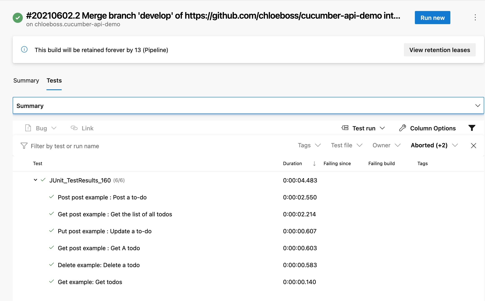

# Cucumber Api Demo

[](https://dev.azure.com/chlozeng/MyFirstProject/_build/latest?definitionId=13&branchName=develop)


#### Repo link 
https://github.com/chloeboss/cucumber-api-demo

### API automation introduction
There are multiple options to test Api eg: Postman, Swagger. In this Demo, I am using Rest Assured which is one of the most used library for REST API automation testing.

> Rest-Assured is a Java-based library that is used to test RESTful Web Services. This library behaves like a headless Client to access REST web services. We can create highly customize-able HTTP Requests to send to the Restful server. This enables us to test a wide variety of Request combinations and in turn test different combinations of core business logic.

### Test Scenario
Here test two scenarios which covers both UI and Api
1. API endpoint: https://jsonplaceholder.typicode.com/todos

```Gherkin 
 @api @testEnv
Feature: This is feature about API-Todo

  Scenario: Post post example : Post a to-do
    When Send POST http request with body
      | body  | ChloeZeng |
      | title | QA        |
      | id    | 205       |
    Then Verify response code 201
    Then Verify response body
      | body  | ChloeZeng |
      | title | QA        |
      | id    | 201       |

  Scenario: Get post example : Get A todo
    When Send GET http with Id 25
    Then Verify response code 200
    Then Verify response body
      | userId    | 2        |
      | id        | 25       |
      | title     | voluptas |
      | completed | true     |

```
### What contains in project?
* It allows parallel test execution by using _maven-surefire-plugin_
* In `RunCucumber` file, you can run scenarios with a particular tag. like @api
* Using `PicoContainer` as Dependency Injection (DI) Containers to Sharing Test Context between Cucumber Step Definitions
* Using `ScenarioContext` & `Java Hash Map`to store and share test date between steps
* `Json Schema` validation
* Deserialization with Generics using `io.restassured.mapper.TypeRef` to deserialize the response to a container with a generic type
* Authentication
* Specification Re-use by using  `RequestSpecBuilder` or `ResponseSpecBuilder.`
* Verifying Response Data: status code, status line, cookies, headers, content type and body
* Specifying Request Data: headers, cookies, body and content type.

### Reporting
* Report would be auto generated when run via maven. Please see attachment report1.
* Or you can find here under Target file _**testReport.html**_, Please see attachment report2.


### Way to execute the tests
1. run maven command, it can also execute features parallel in this case (please see note if it doesn't work)\
   `mvn clean test` \
   or run with tags `mvn test -Dcucumber.filter.tags="@apiContext"`
2. run `feature` files directly
3. run `RunCucumberTest` with Junit


### Continuous Integration
Run in Azure Pipeline
https://dev.azure.com/chlozeng/MyFirstProject/_build?definitionId=13


### Mock Data & Log
TBD


