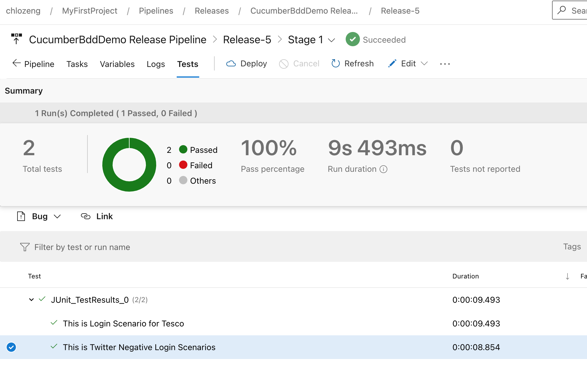

# Cucumber BDD Demo

[](https://dev.azure.com/chlozeng/MyFirstProject/_build/latest?definitionId=11&branchName=master)

<a href="https://dev.azure.com/chlozeng/MyFirstProject/_dashboards/dashboard/0b27603f-ca0a-4ddd-a108-85bae3788ac8">

#### Author Contact Info
```
Chloe Zeng
chloezeng310@gmail.com
+64 021 183 2827
Linkedin: https://www.linkedin.com/in/chloe-zeng/
```
#### Repo link 
https://github.com/chloeboss/cucumber-bdd-demo

### API automation introduction
There are multiple options to test Api eg: Postman, Swagger. In this Demo, I am using Rest Assured which is one of the most used library for REST API automation testing.

> Rest-Assured is a Java-based library that is used to test RESTful Web Services. This library behaves like a headless Client to access REST web services. We can create highly customize-able HTTP Requests to send to the Restful server. This enables us to test a wide variety of Request combinations and in turn test different combinations of core business logic.

### Test Scenario

API endpoint: https://jsonplaceholder.typicode.com/todos
```Gherkin 
@api @testEnv
Feature: This is feature about API-Todo

  @api
  Scenario: Get post example : Get the list of all todos
    When Send GET http request
    Then I should receive SUCCESS response code 200

  @api
  Scenario: Get post example : GET a to-do
    When Send GET http request with Id 25
    Then I should receive SUCCESS response code 200

  @api
  Scenario: Post post example : Post a to-do
    When Send POST http request with Id 25
    Then I should receive SUCCESS response code 201

  @api
  Scenario: Put post example : Update a to-do
    When Send PUT http request with Id 25
    Then I should receive SUCCESS response code 200

  @api
  Scenario: Delete post example : delete a to-do
    When Send DELETE http request with Id 25
    Then I should receive SUCCESS response code 200

```
### What contains in project?
* It allows parallel test execution by using _maven-surefire-plugin_
* In `RunCucumber` file, you can run scenarios with a particular tag. like @api
* Using `PicoContainer` as Dependency Injection (DI) Containers to Sharing Test Context between Cucumber Step Definitions
* Using `ScenarioContext` & `Java Hash Map`to store and share test date between steps

### Reporting
* Report would be auto generated when run via maven. Please see attachment report1.
* Or you can find here under Target file _**testReport.html**_, Please see attachment report2.


### Way to execute the tests
1. `mvn clean test` (please see note if it doesn't work)
2. run from `feature` file
3. run `RunCucumberTest` with Junit


### Continuous Integration
Run in Azure Pipeline
https://dev.azure.com/chlozeng/MyFirstProject/_release?_a=releases&view=mine&definitionId=9



### Mock Data & Log
TBD


