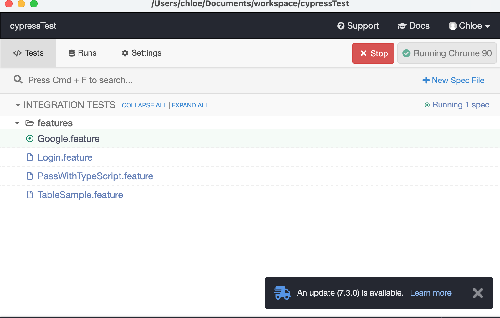
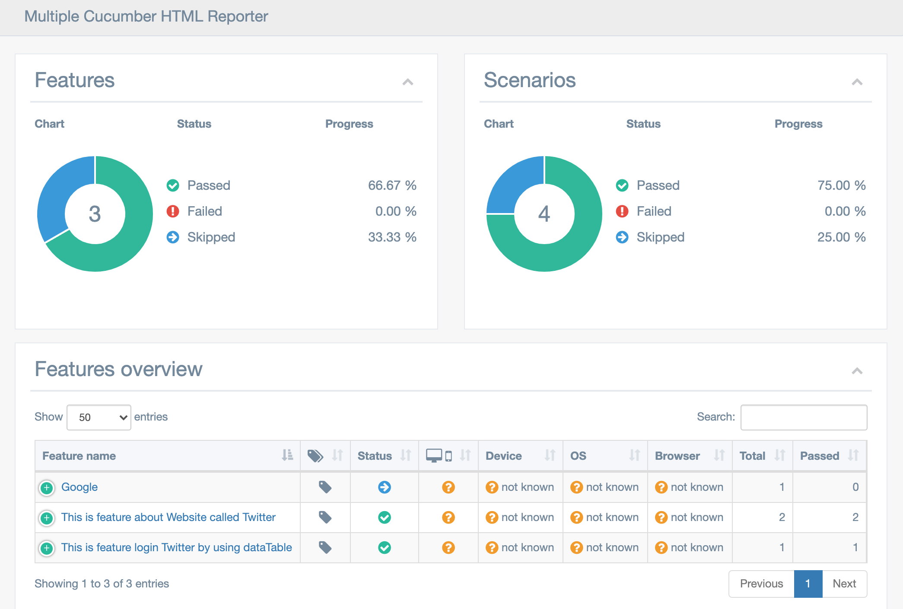
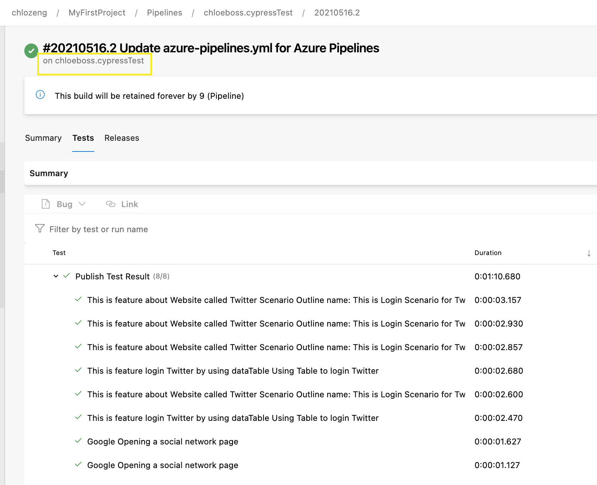

# cypressTest

#### Author Contact Info
```
Chloe Zeng
chloezeng310@gmail.com
+64 021 183 2827
```

#### Repo link
https://github.com/chloeboss/appiumTests/tree/develop

# cypressTest project introduction
This tool is using for end-to-end, Integration testing which only written in JavaScript. for info please go cypress website
This demo is using cucumber Bdd style to write tests.

## Run tests
(requires npm@5.2.0 or greater)
* run via client side, run command: `npx cypress open`, it would open client. this demo set only feature file only
  

* run by command\
  `npx cypress run`

* run with specific browser\
  `npx cypress run --browser chrome`\
  or\
  `npx cypress run -b chrome`

* run with headless mode\
  `npx cypress run --headless --browser chrome`

* run by command line using "cucumber's tag expressions"\
  `npx cypress run -e TAGS='@login'`

* run subset of feature files using "Glob"\
  `npx cypress run -e GLOB='cypress/integration/**/*.feature'`

Note: please read https://docs.cypress.io/guides/guides/command-line#How-to-run-commands get more idea, by default, it runs with headlessly in the Electron browser, basically format is \
`npx cypress run [options]`

## Cucumber
### Page Object
This demo is using _Page Object Design Pattern_, reason behind is Page Object Pattern technique provides a solution for working with multiple web pages and prevents unwanted code duplication and enables an uncomplicated solution for code maintenance
website: https://www.npmjs.com/package/cypress-cucumber-preprocessor \
steps
1. Install dependency `cypress-cucumber-preprocessor`
2. Cypress Configuration \
   2.1 `cypress/plugins/index.js` \
   2.2 `cypress.json` \
   2.3 `index.js` \
   2.4 `package.json`
3. write feature file under `cypress/integration/` this demo put under `cypress/integration/features` [notes: TBD .features file usage???]\
4. write steps file under `cypress/support/step_definitions`,  
   4.1 shared/reusable steps include hook located under `\commond` folder \
   4.2 steps hook includes mocha and cucumber, this demo would only use cucumber ones\
   4.3 folder name has to the same as feature file name \
   4.4 share context between step definitions using `cy.as()` alia

### run test
see "run tests" section

### report
see reporter section

## Test Retries
In the real life, tests sometimes fail due to unpredictable, for example:
- Animations
- API calls
- Test server / database availability
- Resource dependencies availability
- Network issues
  In this demo, I did configuration file `cypress.json` \
```
  "retries": {
    // Configure retry attempts for `cypress run`
    // Default is 0
    "runMode": 2,
    // Configure retry attempts for `cypress open`
    // Default is 0
    "openMode": 0
  }
  ```

## Cypress Dashboard
TBD paid feature

## Reporter
### junit report
There are 2 available for Mocha, no need to install- teamcity and junit. this demo is using junit and cucumber

```
"reporter": "mocha-junit-reporter",
  "reporterOptions": {
    "mochaFile": "cypress/results/reports/junit/test-results.[hash].xml",
    "testsuitesTitle": false
  }
```
junit report example is under reports/junit/

### cucumber report
there are three steps to generate cucumber report
1. Install dependency "multiple-cucumber-html-reporter "
2. Config report in file [_report.js_], which define report path etc
3. Run cucumber feature tests eg:\
   `npx cypress run --spec "cypress/integration/*.feature"`
4. generate report by running command \
   `node report.js`

cucumber report example under _reports/cucumber_report/index.html_


## Azure Continuous Integration
> Running Cypress in Continuous Integration is almost the same as running it locally in your terminal. You generally only need to do two things:

1. Install Cypress
   ```npm install cypress --save-de```
2. Run Cypress ```cypress run```

This demo is run on Azure devops, key task is *Cache* the ~/.cache folder after running

here is the screenshot from azure


### Run test parallel
see example from cypress https://github.com/cypress-io/cypress-example-kitchensink/blob/master/azure-ci.yml


## Advantages of Cypress
There are few reasons why this tool is conventent at the moment.
1. Cypress framework captures snapshots at the time of test execution. This allows QAs or developers to hover over a specific command in the Command Log to see exactly what happened at that particular step.
2. Cypress doesn’t need to add explicit or implicit wait commands in test scripts, unlike Selenium. Cypress waits automatically for commands and assertions.
3. Developers or QAs can use Spies, Stubs, and Clocks to verify and control the behavior of server responses, functions, or timers.
   The automatic scrolling operation ensures that an element is in view before performing any action (for example Clicking on a button)
4. As the programmer writes commands, Cypress executes them in real-time, providing visual feedback as they run.

## Limitations of Cypress
1. One cannot use Cypress to drive two browsers at the same time
2. It doesn’t provide support for multi-tabs
3. Cypress only supports JavaScript for creating test cases
4. Cypress doesn’t provide support for browsers like Safari and IE at the moment.
5. Limited support for iFrames