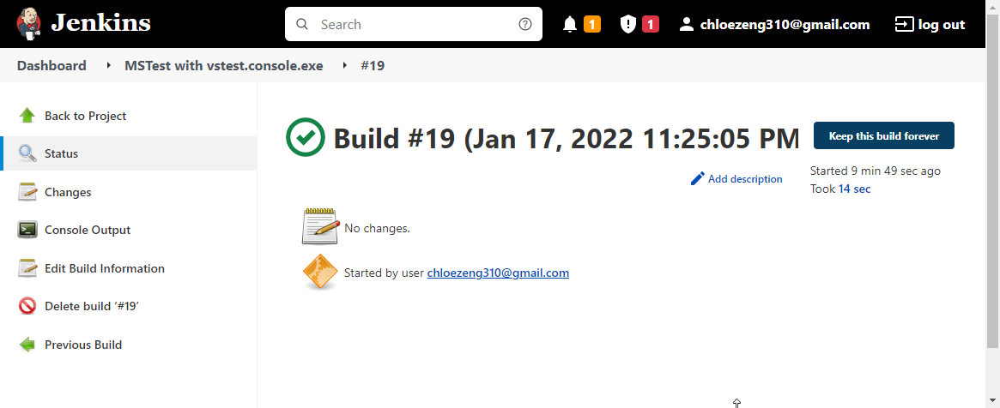
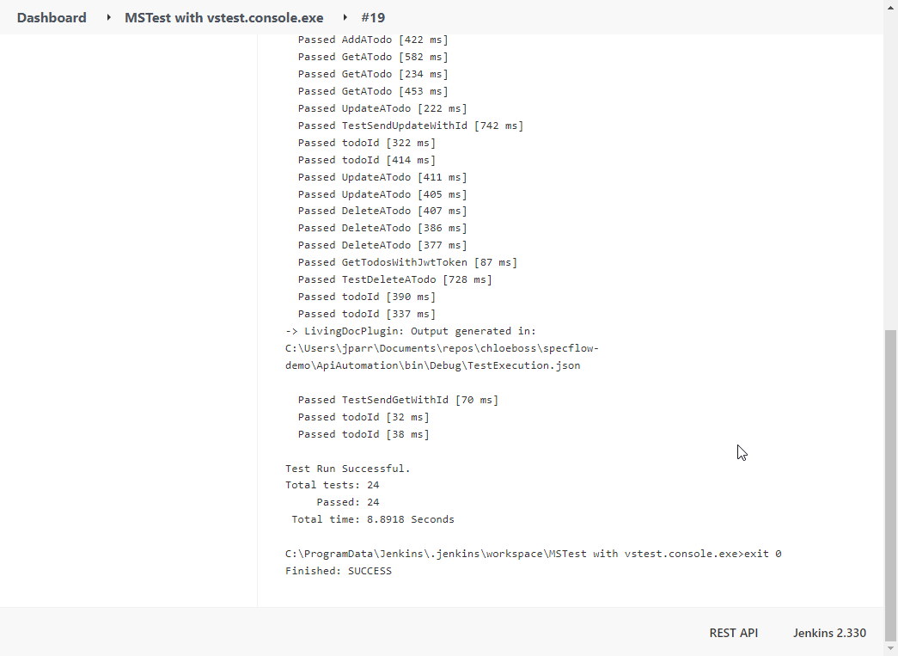

# Test Project run in Jenkins. Docker


#### Author Contact Info
```
Chloe Zeng
chloezeng310@gmail.com
Linkedin: https://www.linkedin.com/in/chloe-zeng/
```


### What contains in project?
Jenkins can be installed through native system packages, Docker, or even run standalone by any machine with a Java Runtime Environment (JRE) installed.

Here I have run both c# tests and java tests in Jenkins which installed in Docker.

#### MSTests Run in Jenkjns







### Note

