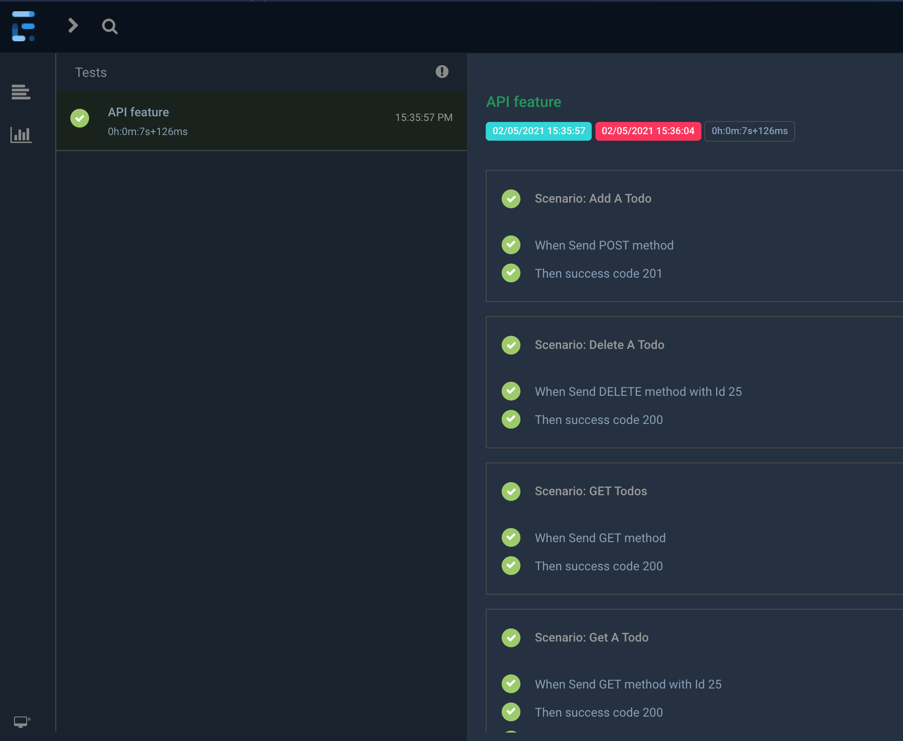

#### Author Contact Info
```
Chloe Zeng
chloezeng310@gmail.com
+64 021 183 2827
```

#### Repo link
https://github.com/chloeboss/specflow-demo/tree/develop/ApiAutomation

# Restsharp specflow Api Demo
There are multiple options to test Api eg: Postman, Swagger. In this Demo, I am using RestSharp which is one of the most used library for REST API automation testing. Also, this project is using BDD style
> Rest-Sharp library also provides ability to validate the HTTP Responses received from server. For e.g. we can verify the Status code, Status message, Headers and even the Body of the response.
### What contains in project?
* Validate Response Status and Header using RestSharp
* Read JSON Response Body using RestSharp
* Send Post/Get/Delete/Put HTTP request
* Execute request with Powerful Generic Deserialization (more explanations please see below)
* ParallelExecution using Context dependency Injection Bodi(see videos)
* Reporting - extent reports

### Test Scenario
Here is the example Api scenario
```Gherkin 
API endpoint: https://jsonplaceholder.typicode.com/todos
@Api
Feature: API feature

@Api
Scenario: GET Todos
When Send GET method
Then success code 200
```

####Execute request with Powerful Generic Deserialization
* Use _*Type para*_, the type pare represents the model of deserialization.
  eg, in this demo, model is <Todo>. we send requests under model, it would return the object of model after deserialization "Response.Data",
  >Response = Client.Execute<Todo>(Request)

#### Extent report
> note: please find sample report under restsharp_api folder
>

### Way to execute the tests
VS from Test Explorer


### Run in Cloud Environment
Run in Azure Pipeline
https://dev.azure.com/chlozeng/MyFirstProject/_release?_a=releases&view=mine&definitionId=9


### Todo
Mock Data & Log
JWT token

### useful links
https://restsharp.dev/
