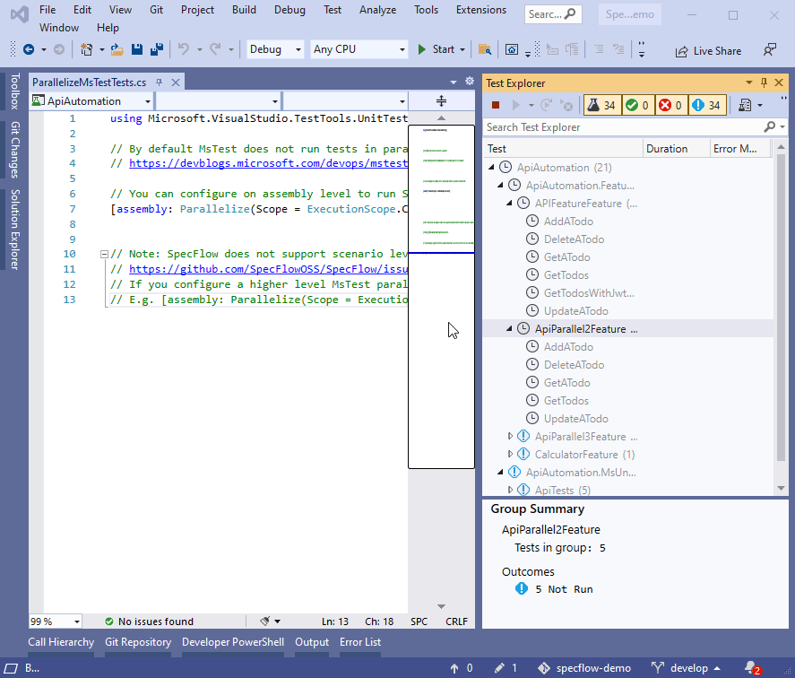
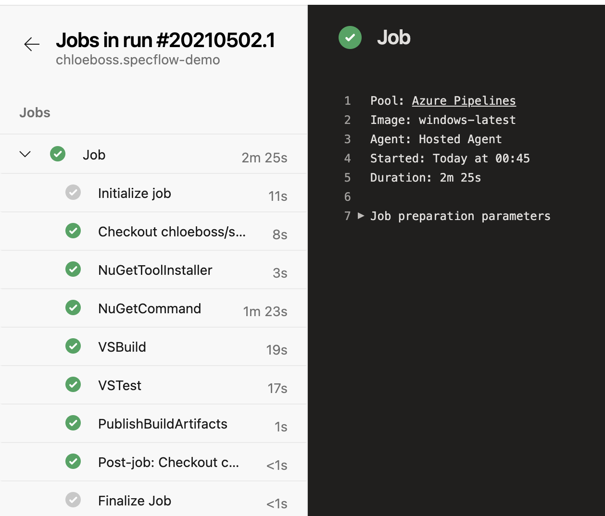
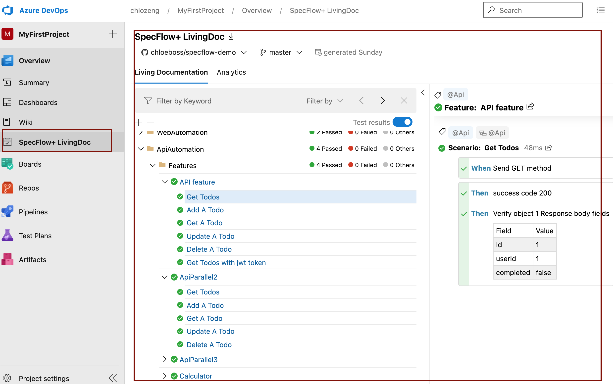

# Restsharp specflow Api Demo
[](https://dev.azure.com/chlozeng/MyFirstProject/_build/latest?definitionId=10&branchName=master)

<a href="https://dev.azure.com/chlozeng/MyFirstProject/_dashboards/dashboard/0b27603f-ca0a-4ddd-a108-85bae3788ac8">

#### Author Contact Info
```
Chloe Zeng
chloezeng310@gmail.com
+64 021 183 2827
```

#### Repo link
https://github.com/chloeboss/specflow-demo/tree/develop/ApiAutomation \
Build in .NETFramework472, Unit Test Provider is `Specflow.MsTest`

### project introduction
There are multiple options to test Api eg: Postman, Swagger. In this Demo, I am using RestSharp which is one of the most used library for REST API automation testing. Also, this project is using BDD style
> Rest-Sharp library also provides ability to validate the HTTP Responses received from server. For e.g. we can verify the Status code, Status message, Headers and even the Body of the response.

### What contains in project?
* Validate Response using RestSharp
  * Response Status
  * Response Headers
  * Response Body
* Send and verify HTTP request
  * Post/Get/Delete/Put
* Execute request with Powerful Generic Deserialization (more explanations please see below)
* Parallel Execution using Context dependency Injection(see videos)
* Reporting 
  * specflow-living doc
* Test Assertion by Specflow.assist CompareToInstance
* Include Authenticators
  * JWT
  * Basic Auth

### Test Scenario
Here is the example Api scenario
```Gherkin 
API endpoint: https://jsonplaceholder.typicode.com/todos
@Api
Feature: API feature

@Api
Scenario: Get Todos
	When Send GET method
	Then success code 200
	Then Verify object 1 Response body fields 
	    | Field     | Value |
        | Id        | 1     |
        | userId    | 1     |
        | completed | false |

@Api
Scenario: Add A Todo
	When Send POST method
	Then success code 201
	Then Verify Response body fields
        | Field     | Value |
        | Id        | 201   |
        | title     | foo   |
        | body      | bar   |
        | completed | false |
```

#### Execute request with Powerful Generic Deserialization
* Use _*Type para*_, the type pare represents the model of deserialization.
  eg, in this demo, model is <Todo>. we send requests under model, it would return the object of model after deserialization "Response.Data",
  >Response = Client.Execute<Todo>(Request)

#### Specflow Living Doc
Using specflow living document which generated by `SpecFlow.Plus.LivingDoc Plugin`
advantage: 
  * Share with team member
  * display test result in HTML file, easy to view, very user friendlys
  * fully supported by Specflow.org

Conclusion: A living documentation is one of those rare tools in software development that offers something of value to all three roles in BDD – Product Owner, Developer and Tester.
And specflow seems is doing really good at it.
> ~~note: please find sample report under restsharp_api folder~~

### Way to execute the tests
from VS, navigator to Test Explorer, run the tests, if you wish to run parallel, then select multiple features to run

### Parallel test execution
By default, Mstest does not run parallel, this demo uses specflow.Mstest, it configures on assembly level to run features in `Class` Level
  * note: Specflow does NOT support run features in scenarios levels
  ```
      using Microsoft.VisualStudio.TestTools.UnitTesting;
      [assembly: Parallelize(Scope = ExecutionScope.ClassLevel)]
  ```



### Continuous Integration
Run in Azure Pipeline
https://dev.azure.com/chlozeng/MyFirstProject/_release?_a=releases&view=mine&definitionId=9


### SpecFlow+ LivingDoc
introduction: https://docs.specflow.org/projects/specflow-livingdoc/en/latest/sbsguides/sbsazdo.html



### Todo
Mock Data 


### useful links
https://restsharp.dev/
