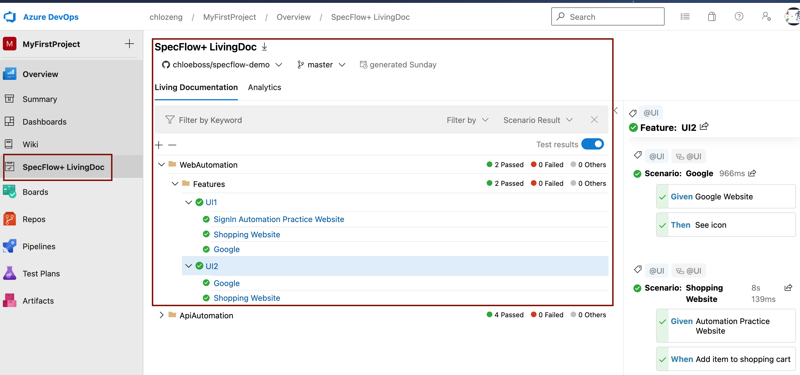

# Specflow ui demo

[](https://dev.azure.com/chlozeng/MyFirstProject/_build/latest?definitionId=10&branchName=master)

#### Author Contact Info
```
Chloe Zeng
chloezeng310@gmail.com
+64 021 183 2827
```

#### Repo link
https://github.com/chloeboss/specflow-demo/tree/develop/WebAutomation \
Build in .NETFramework472, Unit Test Provider is `Specflow.Nunit`

### feature scenarios
Here is the example ui scenario
```Gherkin 
@UI
Feature: UI1

@UI	
Scenario: SignIn Automation Practice Website
	Given Automation Practice Website
	When Try to login
	Then Error should come out

@UI
Scenario: Shopping Website
	Given Automation Practice Website
	When Add item to shopping cart
```


### What contains in project?
* Parallel Execution by Specflow.Nunit
* Customize BoDi container which used in before scenario `Hook`, in this demo, I added `driver`,`pages` to container
* Use _Explicit wait_ to help to _findElement_ call _WebDriverWait_ until the dynamically added element from the script has been added to the DOM
  ```
  WebElement foo = new WebDriverWait(driver, Duration.ofSeconds(3)).until(driver -> driver.findElement(By.name("q")));```
* Tracking log using Nlog, see in folder specflow-uis
* Use "Page Object Model" reason behind is Code becomes less and optimized because of the reusable page methods in the POM classes, also it makes code makes the code cleaner and easy to understand.
* Logging
  * Nlog
* CI - Azure
  * SpecFlow+ LivingDoc
  
### Way to execute tests
from VS, navigator to Test Explorer, run the tests, if you wish to run parallel, then select multiple features to run

### Parallel test execution
By default, NUnit does not run the tests in parallel. Parallelization must be configured by setting an assembly-level attribute in the SpecFlow project.
```
using NUnit.Framework;
[assembly: Parallelizable(ParallelScope.Fixtures)]
```
>Note: SpecFlow does not support scenario level parallelization with NUnit (when scenarios from the same feature execute in parallel). If you configure a higher level NUnit parallelization than “Fixtures” your tests will fail with runtime errors.

### Continuous Integration
Run in Azure Pipeline
https://dev.azure.com/chlozeng/MyFirstProject/_release?_a=releases&view=mine&definitionId=9


### SpecFlow+ LivingDoc
introduction: https://docs.specflow.org/projects/specflow-livingdoc/en/latest/sbsguides/sbsazdo.html


### Logging
I use Nlog for this demo, Nlog can log an activity of test application. It can target to different places: files, db, email, console
Also, it provides different severity/level: Fatal, Error, Warn, Info, Debug, Trace
configured at file, Nlog.config, sample log file see here


### Note
* if driver version not supported, please update @NugetPackage
